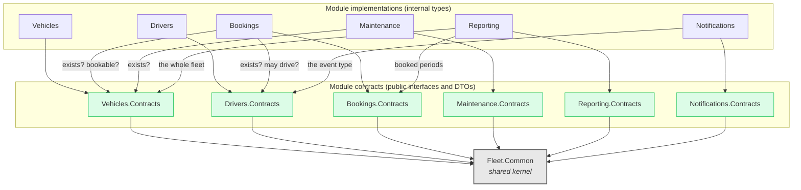
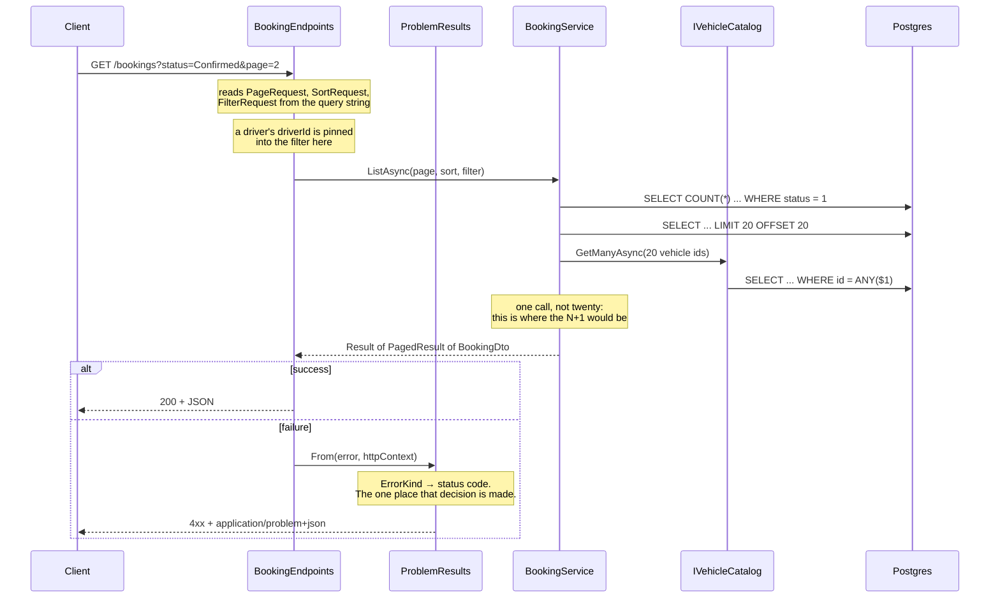
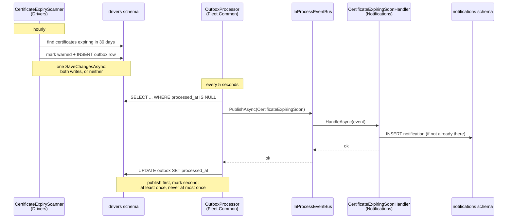
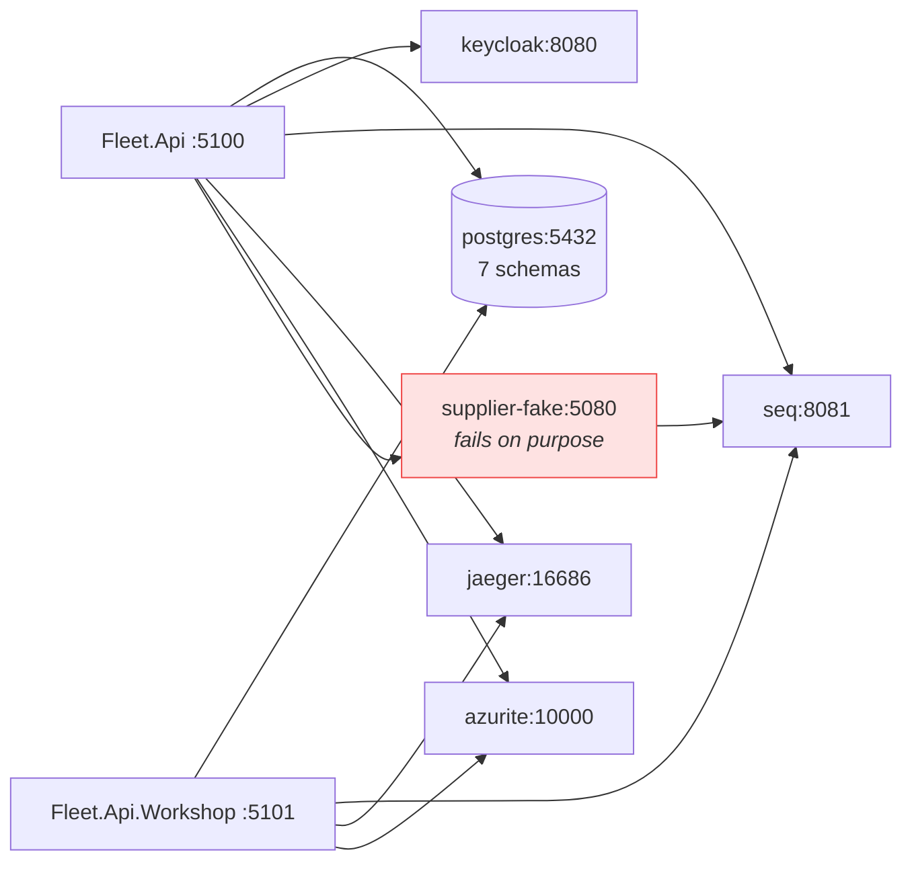

# Architecture

A modular monolith: one process, one database, six modules that cannot see into each other.

The decisions behind this, and what each of them costs, are in [`adr/`](adr/). This page is the
map.

## Module dependencies

Both hosts reference all six module implementations and nothing else - that part is uniform and
uninteresting. What matters is the middle of this diagram: every arrow is a project reference the
compiler enforces, and `tests/Fleet.Architecture.Tests` fails the build if one appears that should
not.

Read the middle of that diagram carefully. **Bookings depends on `Vehicles.Contracts`, never on
`Vehicles`.** It cannot see the `Vehicle` entity, cannot write a join against the `vehicles` schema,
and cannot know that a vehicle has an odometer. It asks `IVehicleCatalog` whether a vehicle exists
and `IVehicleAvailability` whether it may be booked, and those answers are all it gets.

The one arrow that surprises people is `Notifications --> Drivers.Contracts`. The dependency runs
from the *subscriber* to the *publisher*, because Notifications needs the
`CertificateExpiringSoon` type to deserialise it. Drivers has never heard of Notifications and
would work unchanged if it were deleted.

## What each module owns

| Module | Schema | Owns | Cross-module reads |
|---|---|---|---|
| Vehicles | `vehicles` | Vehicles, depots, odometer readings | none |
| Drivers | `drivers` | Drivers, certificates, its own outbox | none |
| Bookings | `bookings` | Bookings | Vehicles, Drivers |
| Maintenance | `maintenance` | Work orders, part lines | Vehicles |
| Reporting | `reporting` | Report jobs | Vehicles, Bookings |
| Notifications | `notifications` | Notifications | Drivers (the event type only) |
| — | `shared` | Idempotency keys | belongs to no module |

No foreign key crosses a schema. That is enforced by nothing except review and the absence of a
navigation property to write one with, and it is checked in `psql` rather than in a test - see
ADR 2 for what it costs.

## How a request travels

`GET /bookings?status=Confirmed&page=2` through the reference host:

The only thing the endpoint decides is HTTP. Whether the booking may be made, whether the window
clashes, whether the driver holds a licence - all of that happened inside the module, and all of it
arrived as a `Result`.

## How an event travels

Nothing calls the Notifications module. Its rows appear because Drivers announced something:

The handler checks before it inserts because delivery is at-least-once and it *will* see a
duplicate eventually. See ADR 6.

## Where the interesting code is

If you read six files before starting, read these:

| File | Why |
|---|---|
| `Fleet.Common/Results/Result.cs` | The type every application service returns |
| `Fleet.Api/Http/ProblemResults.cs` | Where an `ErrorKind` becomes a status code |
| `Fleet.Api/Endpoints/BookingEndpoints.cs` | ETags, preconditions, idempotency, resource auth |
| `Modules/Bookings/.../BookingService.cs` | Two layers of defence against a double booking |
| `Modules/Bookings/.../Migrations/*_InitialBookings.cs` | The `EXCLUDE USING gist` constraint |
| `Modules/Maintenance/.../MaintenanceModuleExtensions.cs` | The `TODO(week-12)`, and why it is there |

## Infrastructure

Both APIs run on your machine with `dotnet run`; everything else is in `docker compose`. The
supplier is the only component that is meant to fail, and it does so reproducibly - same
`FAKE_SEED`, same failures, every run.
